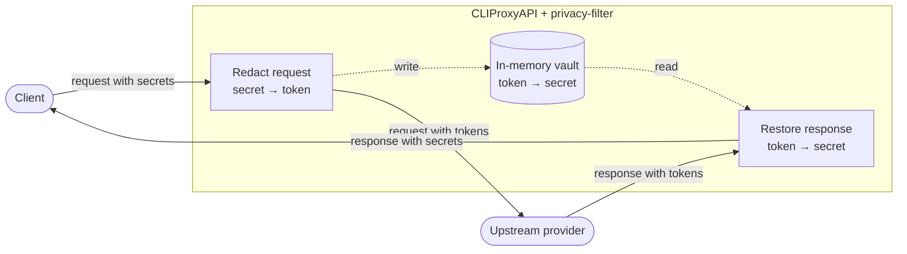
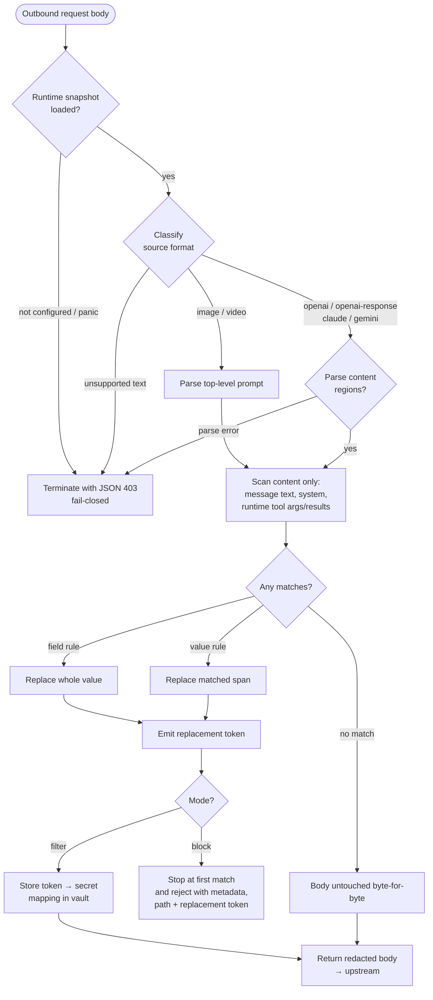
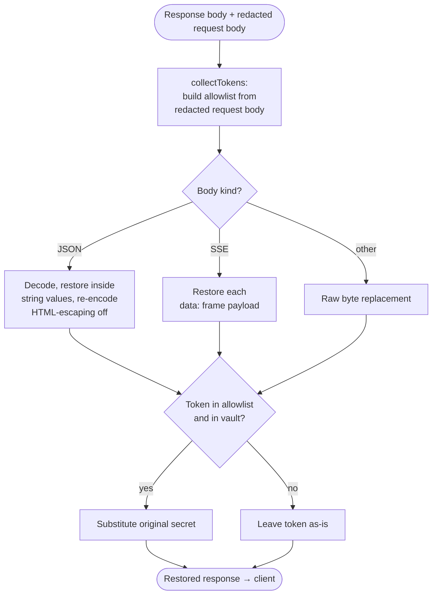
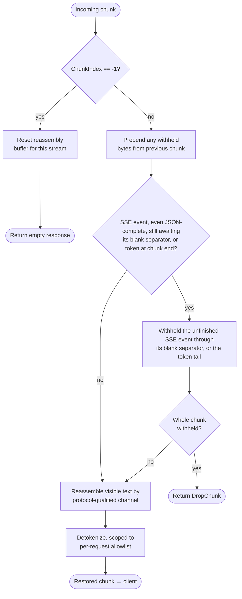

# plugin-privacy-filter

[English](./README.md) | [中文](./README.zh-CN.md)

A privacy protection plugin for [CLIProxyAPI](https://github.com/router-for-me/CLIProxyAPI). In `filter` mode it replaces detection-rule matches found in supported request content regions with reversible tokens and restores them in responses. In `block` mode it validates the complete recognized request structure, stops rule scanning at the first match, and rejects with sanitized metadata and a replacement token. Fields outside the explicitly scanned regions can be forwarded unchanged, so this plugin is not whole-request DLP.

## How it works

The plugin runs as a native C shared library loaded by the host over its plugin ABI. It participates in three interception points:

1. **Request interception** — dispatches on the request's source format and scans only its content regions (user, assistant, and system message text, plus recognized runtime tool arguments and results). Detection rules are not applied to tool/function schemas, model names, or sampling parameters. Matches are replaced with a placeholder token of the form `<LABEL_hash>`, where `hash` is a keyed HMAC-SHA256 of the original value truncated to 16 hex characters. `filter` stores the `token -> original` mapping in an in-memory vault and forwards the rewritten request. After complete structural validation, `block` stops at the first rule match and rejects without storing the rejected plaintext or serializing a rewritten body.
2. **Response interception** — restores vault-backed tokens in the (non-streaming) response body only when they also appear in the request body that was sent upstream. This request-derived gate is not a cryptographic binding to the request or user that originally created a token.
3. **Streaming response interception** — restores tokens chunk by chunk, buffering tokens that are split across chunk boundaries and reassembling them.

### Security model

- **Content-only scanning.** Rules run only over explicit content regions of a recognized request format. Tool/function JSON schemas, model names, routing/sampling parameters, headers, media, identifiers, URLs, encrypted content, and other opaque or unvisited fields are not scanned. This protects protocol structure but means matching plaintext in those regions is not filtered.
- **Keyed token identifiers.** Tokens use HMAC-SHA256 with a 256-bit random process key, but expose only a 16-hex-character (64-bit) tag. The tag alone does not reveal the plaintext; idempotency and restoration additionally require an exact, unexpired vault mapping. Inside a scanned region, token-shaped request text without such a mapping is scanned as ordinary text.
- **Request-derived restoration.** Restoration is gated by an allowlist built from the redacted request body. Only token candidates with an exact, unexpired vault mapping enter it, and at most 1,024 tokens are retained per request/stream. This bounds restoration work and excludes unknown token-shaped input from restoration, but it does not bind a known live token to its originating request or tenant.
- **Fail-closed request handling.** The plugin rejects request-interceptor panics, malformed hook payloads, unsupported source formats, bodies that are not exactly one JSON object, and recognized runtime structures that fail explicit validation. Unknown members and types are rejected where a provider visitor validates them; top-level and opaque nested fields outside those validators can remain unscanned.
- **In-memory vault.** The plugin does not persist token mappings to disk. TTL/LRU bounds limit their lifetime and count; clearing the vault removes its references but does not guarantee zeroing copies that may remain in the Go heap or operating-system memory.
- **Safe block diagnostics.** Block reasons report only the first finding: fixed rule metadata, a schema path with request-controlled keys replaced by `.*`, and the JSON-quoted deterministic replacement token. They do not include surrounding request text. The matched plaintext is never included in the reason or stored in the vault.

## Processing flow

At a high level, the plugin sits between the client and the upstream provider, redacting on the way out and restoring on the way back:



### Plugin lifecycle

The host loads the shared library and drives it over a small C ABI (`cliproxy_plugin_init` / `call` / `free_buffer` / `shutdown`). Every call carries a method name and a JSON request and returns a JSON envelope (`{ok, result, error}`). The methods the plugin implements are:

Protocol compatibility uses two independent version numbers. The native C ABI remains `pluginabi.ABIVersion == 1`. Lifecycle JSON RPC requests require `schema_version >= 3`; a missing version, V1, or V2 is rejected before configuration parsing or runtime mutation. Schema 3 is required for stateful stream-session negotiation and lifecycle callbacks. The plugin always advertises its implemented schema 3 contract, including when a later host schema version is received. Accepting that later lifecycle version does not claim support for unknown future schema features.

- `plugin.register` / `plugin.reconfigure` — parse and validate the config, compile the active rule set, reconfigure the shared vault in place, and publish mode, rules, label, patterns, and vault together as one atomic runtime snapshot. Sharing the vault preserves in-flight mappings and late writes from handlers using an older snapshot.
- `request.intercept_before` / `request.intercept_after` — redact the outbound request body.
- `response.intercept_after` — restore a non-streaming response body.
- `response.intercept_stream_chunk` — restore a streaming response chunk by chunk.
- `plugin.shutdown` — stop cleanup workers and clear both the vault and streaming state, dropping the stores' retained references.

### Request path (redaction)



1. The host hands the plugin the outbound request body along with its source format (the inbound client format, e.g. `openai`, `claude`, `gemini`).
2. The plugin loads the current runtime snapshot (rules + label + vault). If the plugin is not configured yet or panics, it returns `Terminate` with an HTTP 403 JSON error response — the request is refused rather than forwarded unscanned. This is the fail-closed guarantee.
3. It classifies the source format:
   - **Recognized conversational formats** (`openai`, `openai-response`, `claude`, `gemini`) have their content regions scanned.
   - **Image and video formats** (`openai-image`, `openai-video`) have only their top-level text prompt scanned; media and generation parameters remain outside the scanner.
   - **Any other text format** (and any body that cannot be parsed as its declared format) is rejected fail-closed.
4. For a recognized format, only the content regions are scanned — user, assistant, and system message text, legacy and current tool-call arguments/results, Responses computer typing and local-shell command/environment/output text, Claude server-tool textual results, and image/video prompts. Provider-specific visitors accept known runtime content blocks while leaving tool/function schemas, model names, encrypted reasoning, identifiers, URLs, media/file data, and sampling parameters outside the scanner. Top-level protocol fields and opaque nested objects are not recursively scanned; matching plaintext placed there remains unchanged. Both modes first validate the complete recognized structure; only the subsequent rule scan is allowed to stop early in `block` mode.
   - **Field rules** match by key name and replace the whole value under that key.
   - **Value rules** match by regular expression and replace only the matched span.
   - Large integers are preserved via `UseNumber` (no float64 truncation).
   - Existing tokens under any grammar-valid label are not re-tokenized only when their exact mapping is still present in the shared vault. This keeps before/after passes stable across label changes without allowing forged token-shaped text to bypass scanning.
5. In `filter` mode every match is replaced by a placeholder token `<LABEL_hash>`. In `block` mode only the first finding's token is computed for a plaintext-free rejection reason, then rule scanning stops immediately.
6. In `filter` mode the `token -> original` mapping is written to the vault and the redacted body is sent upstream. In `block` mode the request is rejected without writing a vault mapping or serializing the mutated JSON document. If nothing matched, either mode leaves the body byte-for-byte untouched and allows it through.

### Response path (restoration)



1. The host provides both the response body and the request body that was actually sent upstream (already redacted).
2. `collectTokens` scans that redacted request body and admits only candidates with an exact, unexpired vault mapping. It also recognizes mapped tokens inside an exactly decoded JSON string when another interceptor has escaped their angle brackets. The allowlist is capped at 1,024 distinct tokens; any excess placeholders remain unrestored. Admission proves only that a live token is present in this request body, not that this request originally minted it.
3. `restoreBody` restores only tokens in the allowlist:
   - JSON bodies are decoded, restored inside string values, and re-encoded with HTML escaping disabled so the angle brackets survive. OpenAI Chat `choices[].message.tool_calls[].function.arguments` and OpenAI Responses standard `function_call` output arguments are restored as atomic JSON argument strings. JSON string-content escaping keeps quotes, backslashes, newlines, tabs, and control characters valid when the upstream argument string was valid JSON. Malformed argument strings remain unchanged.
   - OpenAI Responses custom-tool input is outside atomic argument-string support. Gemini `functionCall.args` is a structured object and continues through the ordinary JSON walker; it is not treated as an argument-delta channel.
   - Server-sent-event bodies are restored frame by frame inside each `data:` payload.
   - An explicitly non-JSON, non-SSE media type uses raw byte replacement. With no usable Content-Type, the plugin auto-detects JSON/SSE first and leaves malformed JSON-looking data unchanged.
4. A token not in the allowlist, or with no vault entry, is left as-is. Conversely, any known live token included in a later request can enter that request's allowlist, regardless of where the token was originally minted.

### Streaming path



1. On the stream-init call (`ChunkIndex == -1`) the plugin resets any leftover reassembly state for this stream. A repeated init for the same `StreamID` replaces the abandoned attempt's allowlist, raw carry, and semantic argument state. A stable host-provided `StreamID` is the primary state key and lets payload chunks omit the request body. Request-body SHA-256 hashing remains a legacy compatibility path for hosts that do not provide `StreamID` and resend the request body on every chunk.
2. For each data chunk it prepends raw carry from the previous host chunk and uses the same vault-verified, 1,024-token per-request allowlist. Restoration always requires both membership in that allowlist and a live vault mapping.
3. For responses whose Content-Type is `text/event-stream`, a JSON `data:` line can be split inside the `data:` prefix or before, inside, or after a token. This raw chunk-carry layer withholds the whole unfinished SSE event from its first field through the blank dispatch separator, even when its JSON line is already complete. Non-SSE streams never buffer a token-free `data:` prefix; all stream types retain bounded partial-token buffering. Original LF, CRLF, or CR framing is preserved.
4. After raw chunk carry, protocol adapters reassemble possible token prefixes across semantic visible-text events for OpenAI Chat Completions, OpenAI Responses, Claude, and Gemini. Pending text is isolated by protocol and choice/item/block/candidate channel. Gemini streams may contain SSE-framed JSON events or complete bare JSON responses even while the Content-Type remains `text/event-stream`.
5. OpenAI Chat standard function arguments, OpenAI Responses standard function-call argument deltas, and Claude `input_json_delta.partial_json` support cross-event placeholder restoration in independent tool-argument channels. The scanner tracks only constant lexical state plus a possible encoded-token suffix, never complete arguments. JSON string-content escaping preserves valid reconstructed JSON. OpenAI Responses custom-tool input is outside this channel support, while Gemini `functionCall.args` remains a structured object restored by the ordinary JSON walker.
6. Normal Chat finish, Responses done/completed, and Claude block/message terminals flush a matching retained suffix before the terminal event and release that argument state. Client cancellation, a missing protocol terminal, an end callback, or hard memory eviction performs cleanup without response delivery; because the host ignores end-callback response bodies, at most one possible encoded-token suffix per active argument channel can be lost. End cleanup is idempotent and never emits retained state.
7. If a whole chunk is withheld by the raw carry layer, the plugin returns `DropChunk` so the host does not deliver a still-tokenized fragment.
8. Raw withheld data is capped at 1 MiB per stream. An oversized unfinished event or over-limit semantic prefix is emitted unchanged rather than retained or restored unsafely.
9. If restoration turns an entire stream chunk into zero bytes, the plugin returns `DropChunk` so the original placeholder is not delivered.

### Principles

- **Vault-backed token mappings.** A token is `<LABEL_ + HMAC-SHA256(key, original)[:16 hex] + >`. The key is 256 random bits drawn from a CSPRNG at process start; the plugin does not export it, and every restart generates a new key. The visible tag is 64 bits and deterministic for the same plaintext and process key; the full token also uses the current label. A candidate is used for idempotency or restoration only after an exact vault lookup.
- **Request-derived restoration.** The vault is process-wide, while restoration is gated by the bounded, vault-verified allowlist derived from the request body sent upstream. This prevents arbitrary unknown placeholders in a response from being restored and bounds stream state. It is not tenant isolation: a live token acts as a bearer capability if another caller learns and reuses it.
- **Fail closed on the way out, fail safe on the way back.** The request path rejects errors encountered during interception. The response path, by contrast, prefers to leave a token in place rather than risk emitting the wrong value.
- **Atomic hot-reload.** Mode, rules, label, patterns, and vault are published together as one immutable snapshot behind an atomic pointer, so a request in flight during a reconfigure always sees a consistent state.
- **Bounded, in-memory, ephemeral.** The vault is TTL- and size-bounded with LRU eviction and proactive expiry purging. Streaming state has a 4,096-entry limit, a 32 MiB tracked-payload budget, a five-minute TTL with proactive cleanup, a 1 MiB carry limit and 1,024 allowlisted tokens per stream. The plugin does not persist either store, and shutdown drops their retained references.

## Building

Requires Go 1.26+ and a C toolchain (CGO). The plugin is built as a C shared library. The checked-in `go.mod` replaces `github.com/router-for-me/CLIProxyAPI/v7` with `../CLIProxyAPI`, so a source build also needs a compatible CLIProxyAPI checkout at that sibling path, or an updated replacement such as `go mod edit -replace=github.com/router-for-me/CLIProxyAPI/v7=/path/to/CLIProxyAPI`.

```bash
# Linux x64
CGO_ENABLED=1 GOOS=linux GOARCH=amd64 \
  go build -trimpath -ldflags="-s -w" -buildmode=c-shared \
  -o dist/privacy-filter-linux-amd64.so .

# Windows x64 (mingw-w64 gcc toolchain required)
CGO_ENABLED=1 GOOS=windows GOARCH=amd64 CC=gcc \
  go build -trimpath -ldflags="-s -w" -buildmode=c-shared \
  -o dist/privacy-filter-windows-amd64.dll .
```

The release workflow produces prebuilt Linux `.so` and Windows `.dll` artifacts on every `v*` tag.

## Configuration

Configuration lives under the `privacy-filter` plugin subtree in the host config. All keys are optional; defaults are shown below. Parsing is strict: unknown keys, extra YAML documents, non-positive or unrepresentable vault TTLs, unknown or whitespace-padded builtin rule names, and incomplete custom rules reject the configuration without replacing the active runtime snapshot.

| Key | Type | Default | Description |
| --- | --- | --- | --- |
| `enabled` | bool | `false` | Enable the plugin. |
| `priority` | int | `0` | Interceptor ordering relative to other plugins. |
| `mode` | string | `filter` | `filter` rewrites requests and restores responses; after full structural validation, `block` stops rule scanning at the first match and rejects with sanitized metadata, path, and token. Values are exact lowercase. |
| `token_label` | string | `REDACTED` | Label inside `<LABEL_hash>`; must match `[A-Za-z][A-Za-z0-9_-]{0,63}`. |
| `vault_ttl_seconds` | positive int | `3600` | How long a `token -> value` mapping is retained for restore; it must fit in Go's `time.Duration`. |
| `vault_max_entries` | positive int | `1000` | Maximum number of mappings kept in memory. |
| `builtin_rules_enabled` | bool | `true` | Master switch for all builtin detection rules. |
| `disabled_builtin_rules` | []string | `[]` | Builtin rule names to turn off (default-on rules). |
| `enabled_builtin_rules` | []string | `[]` | Builtin rule names to turn on (default-off rules); wins over `disabled_builtin_rules` while `builtin_rules_enabled` is true. |
| `custom_field_rules` | []object | `[]` | Custom field-name rules: `{name, keys[], regex?}`. |
| `custom_value_rules` | []object | `[]` | Custom value-pattern rules: `{name, regex}`. |

> **Interceptor-ordering limitation:** CLIProxyAPI currently applies the same priority order to request and response interceptors. A high priority lets this plugin redact requests before lower-priority plugins, but also makes it restore responses before them, exposing restored plaintext to those plugins. A low priority has the opposite problem. Complete interceptor isolation requires CLIProxyAPI to execute the response chain in reverse order or provide separate request/response priorities; this cannot be fixed by plugin configuration alone.

### Example

```yaml
plugins:
  configs:
    privacy-filter:
      enabled: true
      mode: filter
      token_label: REDACTED
      vault_ttl_seconds: 3600
      vault_max_entries: 1000
      builtin_rules_enabled: true
      enabled_builtin_rules:
        - email
      disabled_builtin_rules:
        - bearer
      custom_field_rules:
        - name: internal_id
          keys: [x_internal_id, internal_id]
      custom_value_rules:
        - name: internal_ticket
          regex: "TICKET-[0-9]{6}"
```

## Detection rules

Rules come in two kinds:

- **Field rules** match by JSON key name. When a key matches, the entire value under that key is replaced. An optional `regex` on a custom field rule constrains the match to values matching that pattern (string values only).
- **Value rules** match by regular expression anywhere in a value or plain text, replacing only the matched span. If the regex declares a capture group, only capture group 1 is replaced and the rest of the match is kept verbatim (see [Capture groups](#capture-groups-partial-replacement)). Tokens emitted by an earlier rule are protected from later rules, preserving one-pass response restoration even when regexes overlap.

Rules may also declare a validator (builtin only): `luhn` for credit card numbers and `china_id` for Chinese ID numbers, which drops matches that fail the checksum.

Builtin rules are defined in [`builtin_rules.json`](./builtin_rules.json) and embedded at build time.

### Supported request formats

The plugin dispatches on the request's source format and only ever applies rules inside content regions:

- **Scanned** — `openai` (message content, refusal/reasoning text, and legacy/current function or custom-tool runtime input), `openai-response` (recognized message/instructions, computer typing, shell, patch, MCP, program, code-interpreter, search, and runtime tool data), `claude` (recognized text/document/system blocks and runtime/server-tool results), `gemini` (known content-part text/code, legacy/current function/tool call and response data, and system instruction), `openai-image` and `openai-video` (top-level prompt only). In `filter` mode matches are redacted; in `block` mode the first match rejects the request and stops further rule scanning. Provider-specific visitors leave tool schemas, model names, URLs, Base64/file data, MIME/discriminator metadata, encrypted content, Gemini `inlineData.data`, and sampling parameters outside the scanner.
- **Rejected (fail-closed)** — any unsupported source format, any body that is not exactly one JSON object, malformed required content, and unsupported members or types inside explicitly validated runtime content objects. The plugin terminates the request through the host with an HTTP 403 JSON error response. The plugin does not validate every top-level protocol field or every member of an opaque nested object.

### Builtin field rules (all default-on)

Configuration uses the rule names in the first column. Key matching is exact and case-insensitive; it does not infer spelling variants beyond those listed.

| Rule name | Matched keys |
| --- | --- |
| `password` | `password`, `passwd`, `pwd` |
| `api_key` | `api_key`, `apikey`, `api-key` |
| `secret` | `secret`, `client_secret` |
| `token` | `token`, `access_token`, `refresh_token`, `id_token` |
| `authorization` | `authorization`, `auth_token` |
| `private_key` | `private_key`, `privatekey` |
| `credential` | `credentials` |
| `session` | `session_key`, `session_token` |

### Builtin value rules

Default-on: `openai_key`, `anthropic_key`, `aws_access_key`, `google_api_key`, `github_token`, `slack_token`, `bearer`, `pem_block`, `ssh_private_key`.

Default-on config rules (match `key: value` / `key=value` lines and tokenize only the value, keeping the key prefix): `config_password`, `config_secret`, `config_api_key`, `config_token`, `config_private_key`, `config_credential`. These use a capture group so vendor-prefixed keys (e.g. `alipay_private_key`) are covered while the key name is preserved verbatim.

Default-off: `aws_secret_key`, `jwt`, `email`, `phone_cn`, `phone_e164`, `id_card_cn` (ID-checksum validated), `credit_card` (Luhn validated), `ipv4`.

Turn a default-off rule on via `enabled_builtin_rules`, or turn a default-on rule off via `disabled_builtin_rules`.

### Capture groups (partial replacement)

By default a value rule replaces its entire matched span with a token. To keep a prefix (or suffix) and replace only the sensitive portion, wrap that portion in a **capture group**. When a value rule's regex declares at least one capture group, only capture group 1 is tokenized; everything else the regex matched is preserved verbatim.

This is the way to "match with context but redact only part of it", since Go's RE2 engine has no lookbehind.

```yaml
      custom_value_rules:
        - name: kv_secret
          regex: '(?i)(?:password|secret|token)\s*[:=]\s*(\S+)'
```

Given the text `password: AbcdAbcd`, only `AbcdAbcd` becomes a token; the `password: ` prefix is kept:

```
password: <REDACTED_1a2b3c4d5e6f7890>
```

Notes:

- Only **capture group 1** is used. To group without capturing (e.g. an alternation like `(?:password|secret|token)`), use a non-capturing group `(?:...)` so it is not treated as group 1.
- Both the prefix and suffix around group 1 are preserved.
- A rule with **no** capture group keeps the original behavior: the whole match is replaced.
- An empty capture-group match is skipped (no empty token is emitted).

## Known limitations

These are intentional tradeoffs, not bugs:

- **Pattern-based detection.** Rules can produce false positives and false negatives. Broad rules such as email, phone number, JWT, card number, and IPv4 detection are default-off for this reason. Encoded, split, obfuscated, or unsupported credential formats may not match.
- **JSON reformatting.** When a body is rewritten, it is decoded and re-encoded, so map key order and whitespace may differ from the upstream bytes (semantically equivalent). This only matters for byte-sensitive consumers such as body signing. Bodies with no rule matches pass through untouched.
- **Non-string secret values.** A non-string secret value (e.g. `{"password": 123456}`) is restored as a JSON string (`"123456"`); the characters are preserved but the JSON kind changes.
- **Streaming edge cases.** Stable `StreamID` is the primary isolation key. On the legacy request-body-hash path, concurrent streams with byte-identical request bodies share state. Client cancellation, a missing protocol terminal, an end callback, or hard memory eviction can discard the one possible encoded-token suffix retained for each active visible-text or supported argument channel; end callbacks clean state but cannot deliver a flush body.
- **Streaming semantic scope.** Cross-event restoration covers visible assistant text plus OpenAI Chat standard function arguments, OpenAI Responses standard function-call arguments, and Claude tool input JSON. It does not cover OpenAI Responses custom-tool input or reasoning fields. Gemini `functionCall.args` remains structured JSON restored event by event through the generic walker.
- **Empty non-streaming restoration.** The host ABI uses an empty response `Body` to mean "no replacement," so it cannot represent restoring a response body that consists solely of a token mapped to the empty string. Streaming has an explicit `DropChunk` signal and handles the equivalent case safely.
- **Content-region coverage.** Only recognized request formats and explicit runtime content regions are scanned. Headers, schemas, URLs, identifiers, media/file data, encrypted content, protocol metadata, and unvisited fields can carry matching plaintext upstream unchanged. Unsupported source formats are rejected, but provider schema drift can either trigger validation rejection or introduce an unvisited field that is preserved unscanned.
- **Token provenance and tenant isolation.** Restoration allowlists are derived from token presence in the current request body, not from authenticated request or tenant provenance. A caller that learns a still-live process-wide token can replay it in another request and make it eligible for restoration. Use separate plugin processes or vault trust boundaries when callers must be isolated.
- **Token length and equality leakage.** The token tag is a 64-bit truncated HMAC, not a 256-bit identifier. Accidental collisions are very unlikely at the default 1,000-entry vault size, but the security margin is 64 bits, and equal plaintext produces equal tokens during one process run while the token label is unchanged.
- **Memory erasure.** Clearing or evicting an entry removes references from plugin data structures but does not cryptographically zero Go heap copies. Process compromise, core dumps, swap, and memory forensics are outside this plugin's protection boundary.

## Development

```bash
gofmt -w .
go test ./...
go test -race ./...
go vet ./...
```

## License

Licensed under the [MIT License](./LICENSE).
