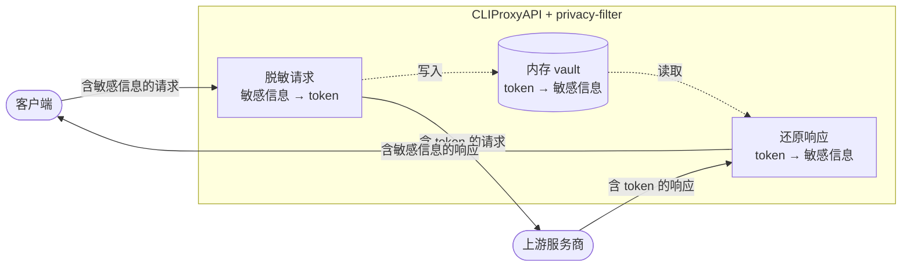
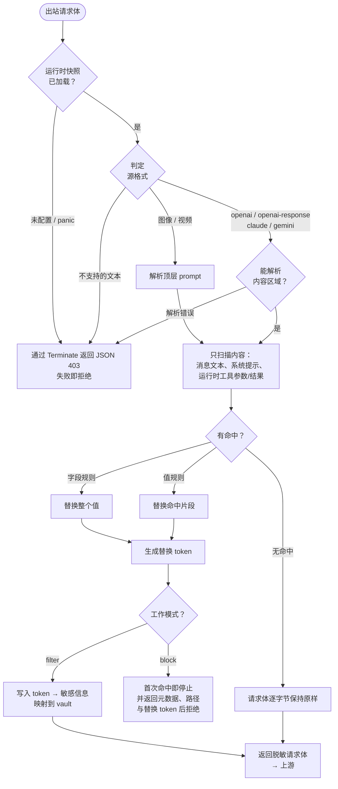
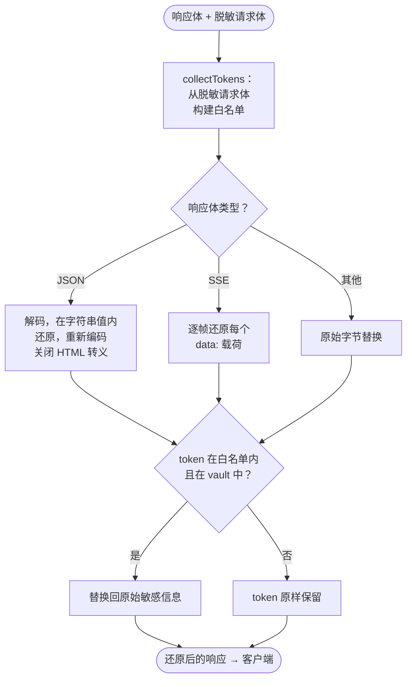
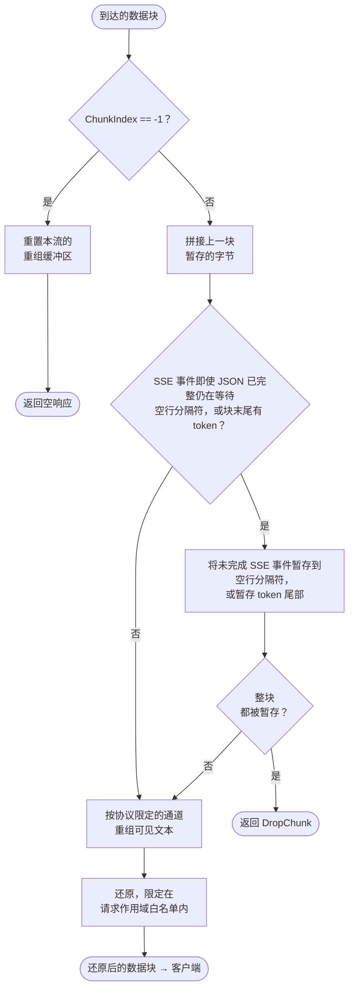

# plugin-privacy-filter

[English](./README.md) | [中文](./README.zh-CN.md)

一个用于 [CLIProxyAPI](https://github.com/router-for-me/CLIProxyAPI) 的隐私保护插件。`filter` 模式会把受支持请求内容区域内命中检测规则的数据替换为可逆 token，并在响应中还原；`block` 模式会先完整校验已识别的请求结构，再在规则首次命中时停止扫描，并返回经过净化的元数据和替换 token。明确扫描范围之外的字段可能被原样转发，因此本插件不是全请求 DLP。

## 工作原理

该插件以原生 C 共享库的形式运行，由宿主通过其插件 ABI 加载。它参与三个拦截点：

1. **请求拦截** —— 根据请求的源格式分派，只扫描其内容区域（用户、助手和系统消息文本，以及已识别的运行时工具参数和结果）。检测规则不会应用于工具/函数 schema、模型名或采样参数。命中的内容被替换为形如 `<LABEL_hash>` 的占位符 token，其中 `hash` 是对原始值做带密钥的 HMAC-SHA256 后截取的 16 位十六进制字符。`filter` 会把 `token -> 原文` 映射存入内存 vault 并转发改写后的请求；`block` 在完整结构校验后于规则首次命中时停止并拒绝请求，既不存储被拒绝的明文，也不序列化改写后的请求体。
2. **响应拦截** —— 只有仍存在于 vault 且同时出现在实际发往上游请求体中的 token，才会在非流式响应中还原。这种由请求体导出的限制并未把 token 与最初生成它的请求或用户进行密码学绑定。
3. **流式响应拦截** —— 逐块还原 token，跨块边界被切断的 token 会被缓冲并重新拼接。

### 安全模型

- **仅扫描内容。** 规则只在已识别请求格式的明确内容区域内运行。工具/函数 JSON schema、模型名、路由/采样参数、请求头、媒体、标识符、URL、加密内容以及其他不透明或未访问字段都不会被扫描。这能保护协议结构，但这些区域内的匹配明文不会被过滤。
- **带密钥的 token 标识符。** token 使用进程启动时由 CSPRNG 生成的 256 位随机密钥执行 HMAC-SHA256，但只公开 16 位十六进制字符，即 64 位标签。仅凭标签无法推导明文；幂等处理和还原还要求 vault 中存在精确且未过期的映射。在扫描区域内，没有此类映射的 token 形状文本仍按普通文本扫描。
- **由请求导出的还原范围。** 还原受一份从脱敏后请求体构建的白名单约束。只有在 vault 中存在精确且未过期映射的 token 候选才会进入白名单，并且每个请求/流最多保留 1024 个 token。这能限制还原工作并把未知 token 形状输入排除在还原范围外，但不会把已知的有效 token 绑定到其来源请求或租户。
- **请求处理失败即拒绝。** 请求拦截器 panic、hook 载荷格式错误、不支持的源格式、不是严格单一 JSON 对象的请求体，以及未通过明确校验的已识别运行时结构都会导致拒绝。服务商访问器会在实施校验的位置拒绝未知成员和类型；这些校验之外的顶层字段及不透明嵌套字段可能保持未扫描状态。
- **内存 vault。** 插件不会主动把 token 映射持久化到磁盘。TTL/LRU 上限限制其存活时间和数量；清空 vault 会移除其引用，但无法保证仍可能存在于 Go 堆或操作系统内存中的副本被清零。
- **安全的拦截诊断。** 拦截原因只报告首个发现：固定规则元数据、把请求动态键替换为 `.*` 的结构路径，以及用 JSON 引用的确定性替换 token；不会包含请求中的前后文。命中明文绝不会进入拒绝原因或写入 vault。

## 处理流程

从宏观上看，插件位于客户端与上游服务商之间，出站时脱敏、回程时还原：



### 插件生命周期

宿主加载共享库，并通过一套精简的 C ABI（`cliproxy_plugin_init` / `call` / `free_buffer` / `shutdown`）驱动它。每次调用都携带一个方法名和一段 JSON 请求，返回一个 JSON 信封（`{ok, result, error}`）。插件实现的方法有：

协议兼容性使用两个彼此独立的版本号。原生 C ABI 仍为 `pluginabi.ABIVersion == 1`。生命周期 JSON RPC 请求要求 `schema_version >= 3`；缺失版本、V1 或 V2 会在解析配置和修改运行时状态之前被拒绝。Schema 3 提供插件依赖的有状态流会话协商和生命周期回调。即使收到更高的宿主 schema 版本，插件也始终只声明自身实际实现的 schema 3 契约。接受更高的生命周期版本并不表示插件支持未知的未来 schema 功能。

- `plugin.register` / `plugin.reconfigure` —— 解析并校验配置、编译当前规则集、原地重配置共享 vault，并把工作模式、规则、标签、匹配模式和 vault 作为一个原子的运行时快照一起发布。共享 vault 会保留在途映射及仍持有旧快照的处理器产生的延迟写入。
- `request.intercept_before` / `request.intercept_after` —— 脱敏出站请求体。
- `response.intercept_after` —— 还原非流式响应体。
- `response.intercept_stream_chunk` —— 逐块还原流式响应。
- `plugin.shutdown` —— 停止清理任务并同时清空 vault 与流状态，移除两个存储所持有的引用。

### 请求路径（脱敏）



1. 宿主把出站请求体连同其源格式（入站客户端格式，如 `openai`、`claude`、`gemini`）一起交给插件。
2. 插件加载当前运行时快照（规则 + 标签 + vault）。如果插件尚未配置或发生 panic，它会返回 `Terminate` 和 HTTP 403 JSON 错误响应，请求因此被拒绝，而非未经扫描就转发。这就是失败即拒绝（fail-closed）的保证。
3. 插件判定源格式：
   - **已识别的对话格式**（`openai`、`openai-response`、`claude`、`gemini`）会扫描其内容区域。
   - **图像与视频格式**（`openai-image`、`openai-video`）只扫描顶层文本 prompt；媒体数据和生成参数不进入扫描器。
   - **其他任何文本格式**（以及任何无法按其声明格式解析的请求体）都会被失败即拒绝。
4. 对已识别的格式，只扫描内容区域 —— 用户、助手和系统消息文本、新旧工具调用参数/结果、Responses 电脑输入文字与本地 shell 命令/环境变量/输出文本、Claude 服务端工具文本结果，以及图像/视频 prompt。各服务商使用明确的已知运行时内容块白名单；工具/函数 schema、模型名、加密推理、标识符、URL、媒体/文件数据和采样参数不进入扫描器。顶层协议字段和不透明嵌套对象不会被递归扫描，其中的匹配明文保持不变。两种模式都会先完整校验已识别的结构；只有随后执行的规则扫描可在 `block` 模式中早停。
   - **字段规则** 按键名匹配，替换该键下的整个值。
   - **值规则** 按正则表达式匹配，只替换命中的片段。
   - 大整数通过 `UseNumber` 保留（不会被 float64 截断）。
   - 任意符合标签语法的已有 token 只有在共享 vault 中仍有精确映射时才不会被再次 token 化；这样既能在 before/after 阶段之间更换标签时保持稳定，也不会让伪造的 token 形状文本绕过扫描。
5. `filter` 模式会把每个命中替换为占位符 token `<LABEL_hash>`。`block` 模式只为首个发现计算 token，供不含明文的拒绝原因使用，随后立即停止规则扫描。
6. `filter` 模式把 `token -> 原文` 映射写入 vault，并把脱敏请求体发往上游。`block` 模式拒绝请求，既不写入 vault 映射，也不序列化已修改的 JSON 文档。若无任何命中，两种模式都会让请求体逐字节保持原样并放行。

### 响应路径（还原）



1. 宿主同时提供响应体和实际发往上游的请求体（已脱敏）。
2. `collectTokens` 扫描那份脱敏后的请求体，只接纳在 vault 中有精确且未过期映射的候选。如果其他拦截器对 JSON 字符串中的尖括号进行了转义，它也会在严格解码后的字符串中识别有映射的 token。白名单最多包含 1024 个不同 token；超出的占位符保持不还原。进入白名单只证明当前请求体中存在一个仍有效的 token，并不能证明该 token 最初由这个请求生成。
3. `restoreBody` 只还原请求级 allowlist 内的 token：
   - JSON 响应体会被解码，在字符串值内部还原，再以关闭 HTML 转义的方式重新编码。OpenAI Chat 的 `choices[].message.tool_calls[].function.arguments` 与 OpenAI Responses 标准 `function_call` 输出参数按原子 JSON 参数字符串处理；JSON 字符串内容转义保证上游参数原本合法时，其中的引号、反斜杠、换行、制表符和控制字符仍保持合法。畸形参数字符串保持原样。
   - OpenAI Responses custom tool input 不在这项原子参数字符串支持范围内。Gemini `functionCall.args` 是结构化对象，仍由现有 JSON walker 处理，而不是工具参数增量通道。
   - 服务器推送事件（SSE）响应体会在每个 `data:` 载荷内逐帧还原。
   - 明确的非 JSON、非 SSE 媒体类型使用原始字节替换。缺少可用的 Content-Type 时，插件会先自动识别 JSON/SSE，并让格式错误但形似 JSON 的数据保持不变。
4. 不在白名单内、或 vault 中无对应条目的 token 会原样保留。反过来，任何被放入后续请求且仍有效的已知 token 都可能进入该请求的白名单，与它最初由哪个请求生成无关。

### 流式路径



1. 在流初始化调用（`ChunkIndex == -1`）时，插件会重置该流遗留的重组状态。同一 `StreamID` 的重复初始化会替换已放弃尝试中的 allowlist、原始 carry 和语义参数状态。现代 StreamID 主路径以宿主提供的稳定 `StreamID` 作为状态键，后续载荷 chunk 无需重复请求体；没有 `StreamID` 且每个 chunk 重发请求体的宿主使用 legacy 请求体哈希兼容路径。
2. 对每个数据块，插件先拼接上一宿主 chunk 留下的原始 carry，并复用最多 1024 个 token 的请求级 allowlist。每次还原都必须同时通过请求级 allowlist 与 live vault 两道 gate。
3. 当响应 Content-Type 为 `text/event-stream` 时，JSON `data:` 行可能在 `data:` 前缀内部，或在 token 之前、内部、之后跨块切断。这个原始 chunk carry 层会从事件的第一个字段开始暂存整个未完成 SSE 事件，直到收到用于派发事件的空行；即使 JSON 行已经完整也同样如此。非 SSE 流不会暂存不含 token 的 `data:` 前缀；所有流类型仍使用有界的 token 尾部缓冲。原始 LF、CRLF 或 CR 分帧保持不变。
4. 完成原始 chunk carry 后，协议适配器会为 OpenAI Chat Completions、OpenAI Responses、Claude 和 Gemini 跨语义可见文本事件重组可能的 token 前缀。待处理文本按协议以及 choice/item/block/candidate 通道隔离。Gemini 流既可能包含 SSE 分帧的 JSON 事件，也可能在 Content-Type 仍为 `text/event-stream` 时直接包含完整的裸 JSON 响应。
5. OpenAI Chat 标准函数参数、OpenAI Responses 标准函数调用工具参数增量，以及 Claude `input_json_delta.partial_json` 支持跨事件占位符还原，并使用相互隔离的工具参数增量通道。扫描器只保存常量大小的词法状态与一个可能的编码 token 短尾，从不缓存完整 arguments；JSON 字符串内容转义保证重建后的 JSON 合法。OpenAI Responses custom tool input 不在此范围，Gemini `functionCall.args` 则继续作为结构化对象由普通 JSON walker 处理。
6. 正常的 Chat finish、Responses done/completed、Claude block/message terminal 会先发出匹配通道的短尾，再释放参数状态。客户端取消、缺少协议 terminal、异常 end cleanup 或硬内存淘汰只清理状态而不尝试投递响应；由于宿主忽略 end callback 的响应体，每个活动参数通道最多丢失一个可能的编码 token 短尾。正常 terminal flushing 与异常 end cleanup 的行为不同，后者不会把短尾发送给客户端；end cleanup 可重复执行，且绝不会输出保留状态。
7. 如果整个 chunk 都被原始 carry 层暂存，插件返回 `DropChunk`，使宿主不会投递仍处于 token 化状态的片段。
8. 每个流最多暂存 1 MiB 原始数据。超过上限的未完成事件或超过状态上限的语义前缀会原样发出，而不是继续驻留内存或进行不安全还原。
9. 如果还原后整个流式 chunk 变成零字节，插件返回 `DropChunk`，避免宿主继续投递原占位符。

### 设计原理

- **由 vault 支持的 token 映射。** token 为 `<LABEL_ + HMAC-SHA256(key, 原文)[:16 位十六进制] + >`。密钥是进程启动时从 CSPRNG 抽取的 256 位随机值；插件不会将其导出，并且每次重启都会重新生成。对相同明文和进程密钥，64 位可见标签是确定性的；完整 token 还使用当前配置的标签。候选只有通过精确 vault 查询后才会用于幂等或还原。
- **由请求导出的还原范围。** vault 是进程级的，还原受实际发往上游请求体所导出的有界且经过 vault 校验的白名单约束。这能防止响应中的任意未知占位符被还原，并限制流状态，但不能提供租户隔离：如果其他调用方获知并重用一个仍有效的 token，它就相当于 bearer capability。
- **出站失败即拒绝，回程失败即保守。** 请求路径会拒绝拦截过程中遇到的错误。相比之下，响应路径宁可保留 token 原样，也不冒险发出错误的值。
- **原子热重载。** 工作模式、规则、标签、匹配模式和 vault 作为一个不可变快照通过原子指针一起发布，因此在 reconfigure 期间在途的请求始终看到一致状态。
- **有界、内存驻留、临时。** vault 带 TTL 和大小上限，采用 LRU 淘汰与主动过期清理。流状态最多 4096 条，带 32 MiB 已计量载荷预算、5 分钟 TTL 与主动清理，每流 carry 最多 1 MiB、白名单最多 1024 个 token。插件不会主动持久化这两个存储，shutdown 时会移除它们所持有的引用。

## 构建

需要 Go 1.26+ 和 C 工具链（CGO）。插件被构建为 C 共享库。仓库中的 `go.mod` 会把 `github.com/router-for-me/CLIProxyAPI/v7` 替换为 `../CLIProxyAPI`，因此从源码构建时还需要在该相邻路径放置兼容的 CLIProxyAPI checkout，或通过类似 `go mod edit -replace=github.com/router-for-me/CLIProxyAPI/v7=/path/to/CLIProxyAPI` 的命令更新替换路径。

```bash
# Linux x64
CGO_ENABLED=1 GOOS=linux GOARCH=amd64 \
  go build -trimpath -ldflags="-s -w" -buildmode=c-shared \
  -o dist/privacy-filter-linux-amd64.so .

# Windows x64（需 mingw-w64 gcc 工具链）
CGO_ENABLED=1 GOOS=windows GOARCH=amd64 CC=gcc \
  go build -trimpath -ldflags="-s -w" -buildmode=c-shared \
  -o dist/privacy-filter-windows-amd64.dll .
```

发布工作流会在每个 `v*` 标签上产出预编译的 Linux `.so` 和 Windows `.dll` 文件。

## 配置

配置位于宿主配置中 `privacy-filter` 插件子树下。所有键均为可选；下表列出默认值。解析采用严格模式：未知键、多份 YAML 文档、非正数或无法表示的 vault TTL、未知或两侧带空白的内置规则名、不完整的自定义规则都会导致配置被拒绝，且不会替换当前运行时快照。

| 键 | 类型 | 默认值 | 说明 |
| --- | --- | --- | --- |
| `enabled` | bool | `false` | 启用插件。 |
| `priority` | int | `0` | 相对其他插件的拦截器排序。 |
| `mode` | string | `filter` | `filter` 改写请求并还原响应；`block` 在完整结构校验后于规则首次命中时早停，并返回经过净化的元数据、路径和 token 后拒绝。值必须是精确的小写形式。 |
| `token_label` | string | `REDACTED` | `<LABEL_hash>` 中的标签；必须匹配 `[A-Za-z][A-Za-z0-9_-]{0,63}`。 |
| `vault_ttl_seconds` | 正整数 | `3600` | `token -> 值` 映射保留多久以供还原；必须能由 Go 的 `time.Duration` 表示。 |
| `vault_max_entries` | 正整数 | `1000` | 内存中保留的映射数量上限。 |
| `builtin_rules_enabled` | bool | `true` | 所有内置检测规则的总开关。 |
| `disabled_builtin_rules` | []string | `[]` | 要关闭的内置规则名（默认开启的那些）。 |
| `enabled_builtin_rules` | []string | `[]` | 要开启的内置规则名（默认关闭的那些）；当 `builtin_rules_enabled` 为 true 时优先级高于 `disabled_builtin_rules`。 |
| `custom_field_rules` | []object | `[]` | 自定义字段名规则：`{name, keys[], regex?}`。 |
| `custom_value_rules` | []object | `[]` | 自定义值模式规则：`{name, regex}`。 |

> **拦截器顺序限制：** CLIProxyAPI 当前对请求与响应拦截器使用相同的优先级顺序。高优先级可以让本插件先于低优先级插件脱敏请求，但也会让它先于这些插件还原响应，使后续插件看到明文；低优先级则正好相反。要实现完整的插件间隔离，CLIProxyAPI 必须反向执行响应链，或分别提供请求与响应优先级；仅靠插件配置无法解决。

### 示例

```yaml
plugins:
  configs:
    privacy-filter:
      enabled: true
      mode: filter
      token_label: REDACTED
      vault_ttl_seconds: 3600
      vault_max_entries: 1000
      builtin_rules_enabled: true
      enabled_builtin_rules:
        - email
      disabled_builtin_rules:
        - bearer
      custom_field_rules:
        - name: internal_id
          keys: [x_internal_id, internal_id]
      custom_value_rules:
        - name: internal_ticket
          regex: "TICKET-[0-9]{6}"
```

## 检测规则

规则分为两类：

- **字段规则** 按 JSON 键名匹配。键名命中时，该键下的整个值都会被替换。自定义字段规则上的可选 `regex` 会把匹配约束为符合该模式的值（仅限字符串值）。
- **值规则** 按正则表达式匹配值或纯文本中的任意位置，只替换命中的片段。若正则声明了捕获组，则只替换捕获组 1，匹配到的其余部分原样保留（见 [捕获组](#捕获组部分替换)）。较早规则生成的 token 会对后续规则保持受保护状态，因此即使正则重叠也能维持单次响应还原的可逆性。

规则还可声明校验器（仅内置）：`luhn` 用于信用卡号，`china_id` 用于中国身份证号，会剔除校验和不通过的匹配。

内置规则定义在 [`builtin_rules.json`](./builtin_rules.json) 中，并在构建时通过 embed 嵌入。

### 支持的请求格式

插件根据请求的源格式分派，且只在内容区域内应用规则：

- **扫描** —— `openai`（消息内容、拒绝/推理文本，以及新旧函数或 custom tool 的运行时输入）、`openai-response`（已识别消息/instructions、电脑输入、shell、补丁、MCP、程序、代码解释器、搜索和运行时工具数据）、`claude`（已识别文本/文档/system 块与运行时/服务端工具结果）、`gemini`（已知 content part 文本/代码、新旧函数/工具调用与响应数据，以及 system instruction）、`openai-image` 与 `openai-video`（仅顶层 prompt）。`filter` 模式对命中内容脱敏；`block` 模式在首个命中时拒绝请求并停止后续规则扫描。各服务商专用访问器不会把工具 schema、模型名、URL、Base64/文件数据、MIME/类型元数据、加密内容、Gemini `inlineData.data` 和采样参数送入扫描器。
- **拒绝（失败即拒绝）** —— 不支持的源格式、不是严格单一 JSON 对象的请求体、格式错误的必需内容，以及明确校验的运行时内容对象中不支持的成员或类型。插件通过宿主终止请求并返回 HTTP 403 JSON 错误响应。插件不会校验所有顶层协议字段，也不会校验每个不透明嵌套对象的所有成员。

### 内置字段规则（默认全部开启）

配置中使用第一列的规则名。键名采用精确、不区分大小写的匹配，不会推断下表之外的拼写变体。

| 规则名 | 匹配的键 |
| --- | --- |
| `password` | `password`、`passwd`、`pwd` |
| `api_key` | `api_key`、`apikey`、`api-key` |
| `secret` | `secret`、`client_secret` |
| `token` | `token`、`access_token`、`refresh_token`、`id_token` |
| `authorization` | `authorization`、`auth_token` |
| `private_key` | `private_key`、`privatekey` |
| `credential` | `credentials` |
| `session` | `session_key`、`session_token` |

### 内置值规则

默认开启：`openai_key`、`anthropic_key`、`aws_access_key`、`google_api_key`、`github_token`、`slack_token`、`bearer`、`pem_block`、`ssh_private_key`。

默认开启的配置规则（匹配 `key: value` / `key=value` 形式的行，只替换值、保留键名前缀）：`config_password`、`config_secret`、`config_api_key`、`config_token`、`config_private_key`、`config_credential`。它们使用捕获组，因此带厂商前缀的键（如 `alipay_private_key`）也能覆盖，同时键名原样保留。

默认关闭：`aws_secret_key`、`jwt`、`email`、`phone_cn`、`phone_e164`、`id_card_cn`（经 ID 校验）、`credit_card`（经 Luhn 校验）、`ipv4`。

通过 `enabled_builtin_rules` 开启某个默认关闭的规则，或通过 `disabled_builtin_rules` 关闭某个默认开启的规则。

### 捕获组（部分替换）

默认情况下，值规则会把整段命中内容替换成 token。如果只想保留前缀（或后缀）、仅替换其中敏感的部分，就把该部分用**捕获组**（圆括号）包起来。当值规则的正则声明了至少一个捕获组时，只有捕获组 1 会被替换成 token，正则匹配到的其余内容原样保留。

由于 Go 的 RE2 引擎不支持 lookbehind，这就是"带上下文匹配、但只脱敏其中一部分"的实现方式。

```yaml
      custom_value_rules:
        - name: kv_secret
          regex: '(?i)(?:password|secret|token)\s*[:=]\s*(\S+)'
```

对文本 `password: AbcdAbcd`，只有 `AbcdAbcd` 会变成 token，前缀 `password: ` 保留：

```
password: <REDACTED_1a2b3c4d5e6f7890>
```

说明：

- 只使用**捕获组 1**。若只想分组而不捕获（例如 `(?:password|secret|token)` 这样的多选一），请用非捕获组 `(?:...)`，以免被当成捕获组 1。
- 捕获组 1 前后的前缀和后缀都会被保留。
- **没有**捕获组的规则维持原行为：整段命中被替换。
- 捕获组匹配到空串时会被跳过，不会生成空 token。

## 已知限制

以下是有意为之的取舍，并非缺陷：

- **基于模式的检测。** 规则可能出现误报和漏报。电子邮件、电话号码、JWT、银行卡号和 IPv4 等宽泛规则因此默认关闭。编码、拆分、混淆或尚不支持的凭据格式可能无法命中。
- **JSON 重新格式化。** 当请求体被改写时，它会被解码后重新编码，因此 map 的键顺序和空白可能与上游字节不同（语义等价）。这只对字节敏感的消费方（如请求体签名）有影响。没有规则命中的请求体会原样透传。
- **非字符串敏感值。** 非字符串敏感值（如 `{"password": 123456}`）会以 JSON 字符串（`"123456"`）的形式还原；字符内容保留，但 JSON 类型发生变化。
- **流式边界情况。** 现代 StreamID 主路径使用稳定 `StreamID` 隔离流；legacy 请求体哈希兼容路径中，请求体字节完全相同的并发流会共享状态。客户端取消、缺少协议 terminal、异常 end cleanup 或硬内存淘汰，可能丢弃每个活动可见文本或受支持参数通道保留的一个编码 token 短尾；end callback 只能清理状态，不能投递 flush 响应体。
- **流式语义范围。** 跨事件还原覆盖助手可见文本，以及 OpenAI Chat 标准函数参数、OpenAI Responses 标准函数调用参数和 Claude 工具输入 JSON；不覆盖 OpenAI Responses custom tool input 或推理字段。Gemini `functionCall.args` 仍是结构化 JSON，只在单个事件内由通用 walker 处理。
- **非流式空内容还原。** 宿主 ABI 用空响应 `Body` 表示“不替换”，因此无法表达“整个响应体只有一个映射到空字符串的 token”这一还原结果。流式 ABI 提供明确的 `DropChunk` 信号，可以安全处理对应情况。
- **内容区域覆盖范围。** 只有已识别的请求格式和明确的运行时内容区域会被扫描。请求头、schema、URL、标识符、媒体/文件数据、加密内容、协议元数据和未访问字段中的匹配明文可能原样发往上游。不支持的源格式会被拒绝，但服务商 schema 漂移既可能触发校验拒绝，也可能引入一个被保留但未扫描的字段。
- **Token 来源与租户隔离。** 还原白名单根据当前请求体中是否存在 token 构建，而不是根据经过认证的请求或租户来源构建。获知一个仍有效的进程级 token 的调用方，可以在另一请求中重放它并使其具备还原资格。需要隔离调用方时，应使用独立插件进程或独立 vault 信任边界。
- **Token 长度与相等性泄露。** token 标签是截断到 64 位的 HMAC，并非 256 位标识符。在默认 1000 条 vault 上限下，意外碰撞概率极低，但其安全裕量仍为 64 位，而且同一进程运行期间，在 token 标签不变时，相同明文会产生相同 token。
- **内存擦除。** 清空或淘汰条目只会从插件数据结构中移除引用，不会以密码学方式清零 Go 堆中的副本。进程被攻破、core dump、swap 和内存取证不属于本插件的保护边界。

## 开发

```bash
gofmt -w .
go test ./...
go test -race ./...
go vet ./...
```

## 许可证

采用 [MIT 许可证](./LICENSE)。
